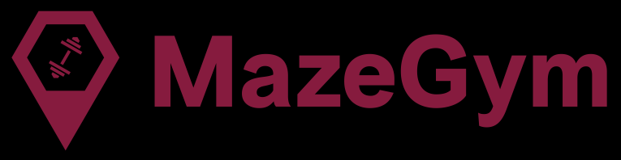

# **MazeGym Website**

[View the live project here.](https://ernestamajute.github.io/MazeGym-MS1/)

This is the marketing website for Maze Gym. It is designed for all range of devices. Created for members and potential customers. Website features are home page, about, classes, gallery sections and footer with opening hours ant contact info. Website's goal is to provide information for potential customers and current members. 
Site is easy no navigate, sections visualy separated.

#### Business Goals: ####
- Increase memberships
- Easy to access schedule
- Make brand memorable

#### Customer goals of this website: ####
- Clear information about equipment, classes options and flexible schedule
- Easy Sign In process
- Prices
- Location

## **UX** ##

#### Visitors searching for: ####
- Membership prices
- Gym which provides good equipment
- Schedule

#### This Website provides information better: ####
- Because other websites are hard to navigate, hard to focus because design too colorful
- Other websites doesn't provide the most important information

#### Maze Gym Website's advantages: ####
- Minimalistic design makes navigation process intuitive
- Easy to access information like: schedule, and classe packages

 ## **Wireframes** ##

 [Wireframes: desktop, tablet, mobile](https://github.com/ErnestaMajute/MazeGym-MS1/tree/master/wireframes)

## **Features** ##

There is 5 key sections on this website:

 - Home 
 - About
 - Classes
 - Gallery
 - Location and contact information

_Home_

Background picture shows strong and confident person, it motivates people. Home page includes website logo in navigation bar. Sign In form easy to find in Navigation Bar. New member able to Sign In and get first class for free. There is links to about, classes and gallery sections. 

_About_

About section describes gym, has three pictures and button which link to classes section.

_Classes_

Classes section explains prices and other details of membership. Schedule added for visitors and members to check times.

_Gallery_

In gallery section firt Time Visitors and member could see pictures and motivational video.

_Location and contact information_

Added map to see gym's location. As well added opening times, address, email, and phone number. on the bottom social links to gym's social media.

## **Design** ##

#### Colors ####
 - Main colors used in Maze Gym website are wine red, black and grey.

 #### Typography ####

 - Fonts used in Maze Gym website are "Lora" and "Open Sans". "Sans Serif" font added as backup font.

 #### Imagery ####

 - Home page section image covers all section. Chosen to catch attention and create powerful impression.

## **Technologies Used** ##

- [HTML5](https://lt.wikipedia.org/wiki/HTML)
- [CSS](https://en.wikipedia.org/wiki/CSS)
- [JavaScript](https://en.wikipedia.org/wiki/JavaScript)
- [Bootstrap 4](https://getbootstrap.com/)
- [GitHub](https://github.com/)
- [Font Awesome](https://fontawesome.com/)
- [Google Fonts](https://fonts.google.com/)

## **Testing** ##

W3C Validator used to validate all project | HTML: Pass | CSS: Pass |

- Navigation in navbar smooth. Links to sections work.
- Sign In button works. All form's fields, buttons works.
- Buttons functions work.
- Schedule button works, opens new tab with schedule file.
- Gallery carousel works smoothly.
- Social media icons when pushed opens new tab.
- Website tested on Edge, Google Chrome, Safari, Opera.
- Map responds

## **Deployment** ##

Those steps were taking in order to deploy my page from GitHub repository:
1. Log in to GitHub and locate the [ErnestaMajute/MazeGym-MS1](https://github.com/ErnestaMajute/MazeGym-MS1)
2. Click on _settings_
3. Under Source section click on dropdown menu and select _Master Branch_ as your GitHub pages publishing source.
4. Select _save_.

## **Credits** ##

- [Bootstrap 4](https://getbootstrap.com/): library used through all project, to make site responsive by using Bootstrap Grid System.
- [Pricing table](https://getbootstrap.com/docs/4.5/examples/pricing/) piece of the code used.
- [Pexels.com](https://www.pexels.com/) Images
- [README.md sample](https://github.com/Code-Institute-Solutions/SampleREADME)
- [Schedule.pdf](https://www.printablee.com/) template
- [Logo](https://www.namecheap.com/)
- [Video](https://www.youtube.com)

A certain amount of the code has been copied from ( the Rosie Resumet and the WhiskeyDrop project).

All content was written by myself.

## **Acknowledgements** ##
Special Thank You to my mentor Reuben Ferrante for all all help and patience.

    

